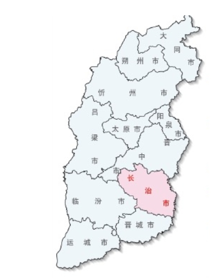
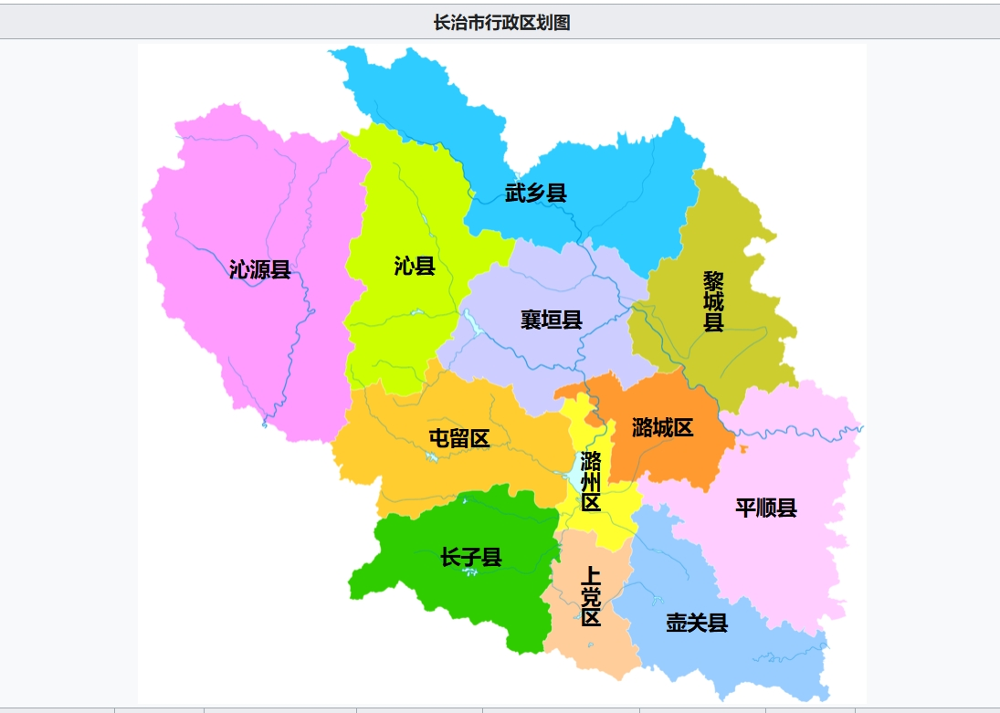
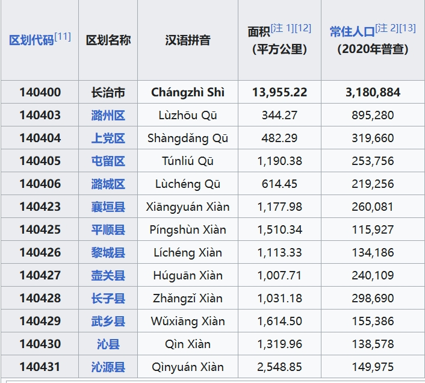
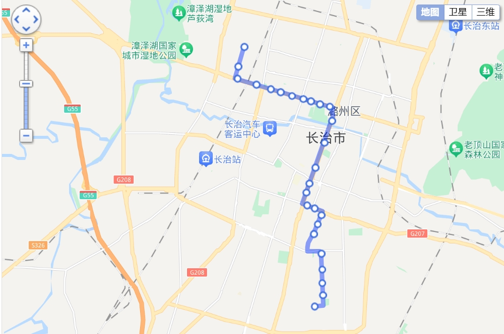
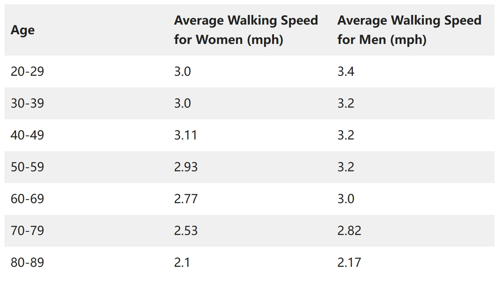
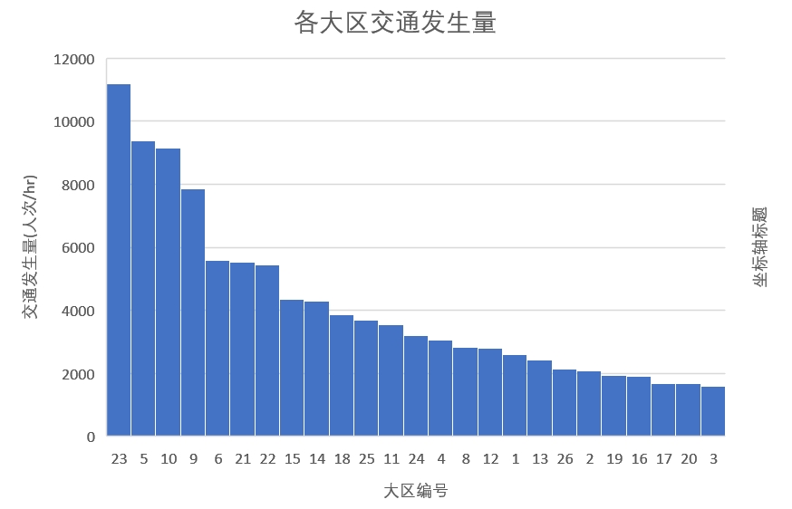

# Data Collection

## 地区特征

### 地区大小

长治市，是中国山西省下辖得地级市，地处山西省东南部，是晋冀豫三省交界。长治市市境南界晋城市，西邻临汾市，北接晋中市，东倚太行山。长治市东西长约150km，南北宽约140km，东西长150千米，南北宽140千米，总面积为13955平方千米，占全省总面积的8.90%。2018年11月行政区划调整后，市辖区面积2631.3平方千米。[[1]](https://zh.wikipedia.org/wiki/长治市#cite_note-3)长治市的地理位置如下图所示：

利用$AutoCAD$对长治市的交通小区进行几何计算，得到交通小区总面积约为82.37平方公里。

### 人口信息

截止2020年第七次人口普查，长治市常住人口318万，中心区潞州区人口89.5万，占总人口约28%。各辖区地理位置如下图，各辖区人口分布见下表。

### 时间价值$\beta$

本小节利用长治市的经济发展相关数据确定该地区的时间价值$\beta$.

根据长治市2023年国民经济和社会发展公报[[3]](https://tjj.changzhi.gov.cn/tjsj/tjgb/202404/P020240422372258189411.pdf)，长治市2023年全年地区生产总值2806.2亿元，人均地区生产总值89536元。按照劳动法，劳动者每周工作时间不应超过44小时，由此可以计算人均地区生产总值的小时平均值，取为本研究的时间价值。
$$
\beta = \frac{\overline{value}}{52\cdot t_{work}} = 39.13 (yuan/hr)
$$

## 车辆特征

### 长治市公交车巡航速度$v_{max}$

本研究利用高德地图$Amap$平台以及长治市已有公交线路(changzhi.gongjiao.com)推算长治市公交车无拥堵时的巡航速度$v_m$

以1路公交为例，公交首发站为体育中心站，终点站为惠丰厂，途径共25站（包括起终点），全程12.7公里，耗时共45分钟。

因此有如下关系：
$$
l = 12.7 (km)
$$

$$
t_l = 45(min)
$$

$$
N_s = 25
$$

暂时估算每站由于上下车和减速启动的损失时间为$t_s = 20s$，则
$$
t = t_l - N_s \cdot t_s \approx36.7(min)
$$
于是可计算最大巡航速度$v_m$
$$
v_m = \frac{l}{t} = 20.8(km/h)
$$
类似可计算17路、10路[红牌]、10路[蓝牌]、302路、11路、9路等市区热门公交路线的巡航速度。计算结果如下表：

| 公交线路   | 运营区域 | 起点       | 终点       | 站数 | 里程(km) | 用时(min) | 巡航速度 |
| ---------- | -------- | ---------- | ---------- | ---- | -------- | --------- | -------- |
| 17路       | 市区     | 惠丰厂     | 客运中心   | 25   | 8.2      | 32        | 20.8     |
| 10路[红牌] | 市郊     | 安居站     | 马厂       | 21   | 8.0      | 33        | 18.5     |
| 10路[蓝牌] | 市郊     | 安居站     | 长治北站   | 20   | 9.0      | 35        | 19.1     |
| 302路      | 市区     | 昌盛商业街 | 杜家河村   | 19   | 15.6     | 50        | 21.4     |
| 11路       | 郊区     | 太行宾馆   | 慈林山煤矿 | 20   | 40.0     | 66        | 40.0     |
| 9路        | 市区     | 城南生态苑 | 景兴花园   | 20   | 7.2      | 31        | 17.8     |

考虑到本次研究涉及的区域主要在市中心区，且高德地图为了保障用户准时到达会对行程耗时保守估计，初步设置公交系统的最大巡航速度$v_{max}'$为：
$$
v_{max}' = 20(km/hr)
$$

### 每站损失时间$t_s$

本小节尝试更加精确地推导公交在每个站点由于减速、启动、上下乘客的损失时间$t_s$. 

#### “减速—启动”过程

假设一辆公交车在抵达站点前以$v_{max}'=20(km/hr)$d的速度行驶，接近站点时以$a = 1.5(m/s^2)$的加速度进行减速。该加速度能保障乘客有一个安全且较为舒适的乘车体验。

类似地，启动时，同样以加速度$a$加速直至回到巡航速度$v_{max}$。可计算这一“减速—启动”过程的损失时间：
$$
t_{lost} = 2\times\frac{v_{max}}{a} - \frac{s_0}{v_{max}}=\frac{v_{max}}{a}
$$
其中$s_0$为公交车在“减速—启动”过程走过的路程

#### 乘客上、下车过程

公交车在开关门时的损失时间分别约为$1s-2s$，于是设置开关门总损失时间
$$
t_{doorlost} = 4s
$$
假设每人次乘客上下车所需的时间为$2s$，每站台上、下车乘客数分别为$x_{aboard}$、$x_{get-off}$，假设公交车为前门上车、后门下车的双门式车型，则乘客上、下车损失时间$t_{pax}$有：
$$
t_{pax} = 2\times max( x_{aboard}, x_{get-off})
$$
综上，可得损失时间$t_s$计算表达式：
$$
t_s = t_{lost} + t_{doorlost} + t_{pax} =\frac{v_{max}}{a} + 4 +2\times max( x_{aboard}, x_{get-off})
$$
于是，在本研究中，设置站点损失时间$t_s$
$$
t_s = 30s
$$

#### 修正巡航速度$v_{max}$

在 **2.1** 中，研究假设公交车在每站点的损失时间为$t_s=20s$，由此计算出了一系列公交线路的巡航速度，并最终给出了本项目的设置最大巡航速度。

现利用 **2.2** 节确定的站点损失时间$t_s = 30s$对前述结果进行修正，结果如下表：

| 公交线路   | 站数 | 里程(km) | 用时(min) | 巡航速度 |
| ---------- | ---- | -------- | --------- | -------- |
| 1路        | 25   | 12.7     | 45        | 23.4     |
| 17路       | 25   | 8.2      | 32        | 25.2     |
| 10路[红牌] | 21   | 8.0      | 33        | 21.3     |
| 10路[蓝牌] | 20   | 9.0      | 35        | 21.6     |
| 302路      | 19   | 15.6     | 50        | 23.1     |
| 11路       | 20   | 40.0     | 66        | 42.9     |
| 9路        | 20   | 7.2      | 31        | 20.6     |

根据修正计算表，最终确定本研究的公交最大巡航速度$v_{max}$为：
$$
v_{max} = 23 (km/hr)
$$

### 乘客走行速度$v_w$

本小节研究乘客为了获取公共交通、抵达目的地或中途换乘时的步行速度$v_w$。

步行是人类的一种基本移动形式，步行速度与人的性别、年龄阶段和个人的健康状况均有关系。考虑到实际的交通规划场景，乘客走行速度也与不同性别、不同年龄段人群的交通发生量有关。

研究[[1]](https://journals.plos.org/plosone/article/file?id=10.1371/journal.pone.0023299&type=printable)基于参加剑桥CardioResource研究的358位献血者的7天自由生活活动数据，得到了步行速度与年龄、姓名的关系。总的来说，步行速度随着年龄的增长而逐渐下降，年轻人(20-29岁)的平均步行速度通常在每秒1.34至1.36米之间，而老年人(65岁及以上)的平均步行速度则降至每秒1.10至1.13米左右。不同年龄女性的步行速度范围为每秒1.13米到1.34米，男性则为每秒1.26米到1.52米。

根据长治市第七次人口普查公报[[2]](https://www.changzhi.gov.cn/xxgkml/zfxxgkml/szfgzbm/czstjj/czsrmzf/tjxx_1188/tjgb/202205/t20220519_2523432.shtml)，对于人口的性别构成，全市男性人口为162万人，占50.88%；女性人口156万人，占49.12%。对于人口的年龄构成：0-14岁人口52万人，占16.48%；15-59岁人口为205万人，占64.36%；60岁及以上人口为61万人，占19.15%，其中65岁及以上人口约41万，占12.96%。较2010年第六次全国人口普查相比，老龄人口比重有所上升。

综合考虑不同年龄段人口速度的加权和、人口老龄化趋势以及不同年龄阶段的出行需求和出行方式选择，本研究最终确定的乘客步行速度$v_w$
$$
v_w = 1.2 (m/s)
$$

### 运营花费

本小节确定公交系统的运营花费参数，包括行驶花销$c_d = c_m +c_t/v_{max} $，停止花销$c_s = c_t t_s$，公路建设花销$c_g$、站点建设花销$c_r$。

由于未能找到长治市近年的公共汽车运营成本数据，本研究参考了浙江衢州公交集团有限公司2018-2020年度的公共汽车运营成本数据[[4]](http://fgw.qz.gov.cn/art/2021/5/14/art_1439968_58830993.html)。该次统计的成本主要由直接运营成本、管理费用、财务费用和营业税金及附加等部分构成。

根据统计，城市公交总运营车辆数约310辆，行驶里程1813万公里，年均客运量2105万人次。运营总成本11142.35万元，单位车辆运营成本为35.8万元，每公里运营成本约6.15元，单位人次运营成本5.29元。

$c_m$表示随行驶里程增加的单位车辆固定成本，$c_t$表示随行驶时间增加的单位车辆成本。考虑到长治市、衢州市的经济发展状况不同，可确定$c_d$
$$
c_d = 6 (元/车次\cdot km)
$$
基础设施的建设通常涉及复杂的规划、设计、施工和维护过程，其成本的摊销需要跨越多年才能完成。而本研究的重点在于设计一套即时运行的公共交通网络，因此，暂不考虑每公里公路的基础建设费用$c_f$以及每个站点的建设分摊到每小时的运营成本$c_r$。于是有：
$$
c_f = c_r = 0
$$

## OD数据分析

### 大区交通生成量

通过对2024年长治市OD数据进行小区合并处理，可以得到25个大区的OD数据。对每个大区的OD数据进行加和，可以得到每个大区的交通发生量，其结果如下表：

| 大区编号 | 大区名称           | 交通发生量(人次/hr) |
| -------- | ------------------ | ------------------- |
| 23       | 湖东北部新区       | 11178.8             |
| 5        | 太行西街现代居住区 | 9388.6              |
| 10       | 东八一广场商务区   | 9142.8              |
| 9        | 西八一广场商务区   | 7865.4              |
| 6        | 高等教育园区       | 5577.1              |
| 21       | 新区起步区         | 5542.6              |
| 22       | 老顶山开发区       | 5445.5              |
| 15       | 城南教育科研区     | 4341.5              |
| 14       | 解放西路居住区     | 4290.2              |
| 18       | 生态区居住区       | 3874.5              |
| 25       | 马厂               | 3693.5              |
| 11       | 城东现在居住区     | 3533.1              |
| 24       | 湖西新区           | 3204.3              |
| 4        | 城北科技园服务区   | 3050.6              |
| 8        | 五一路现代居住区   | 2822.8              |
| 12       | 火车站物流商贸区   | 2793.2              |
| 1        | 城北科技园         | 2599.6              |
| 13       | 火车站配套居住区   | 2440.7              |
| 26       | 故县               | 2130.8              |
| 2        | 城北生态居住区     | 2074.0              |
| 19       | 产业配套居住区     | 1927.9              |
| 16       | 解放东路居住区     | 1901.5              |
| 17       | 城南生态居住区     | 1670.8              |
| 20       | 城区机械工业园区   | 1667.9              |
| 3        | 长兴路居住区       | 1607.2              |

